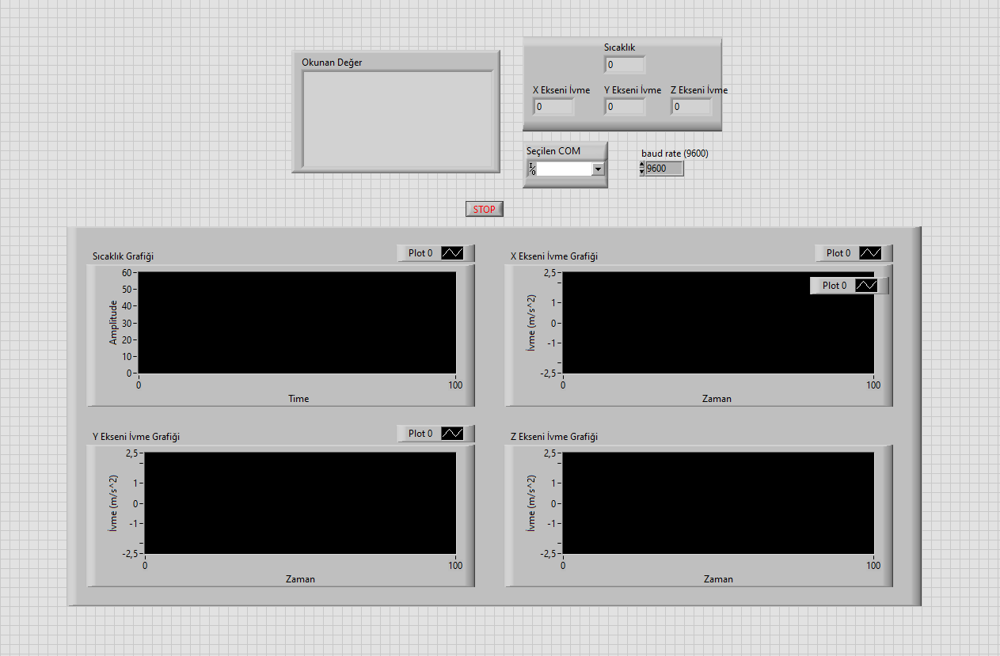
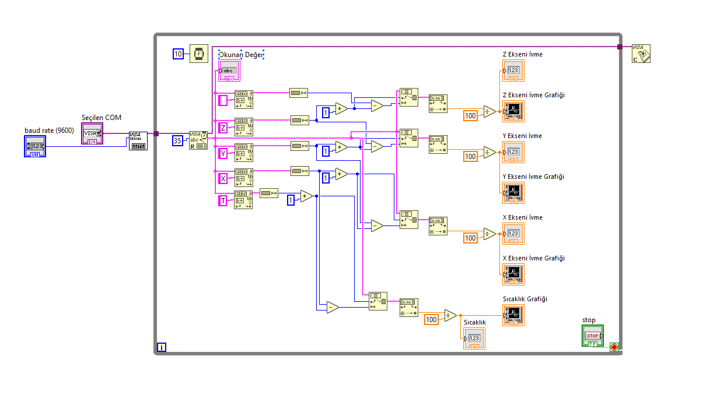
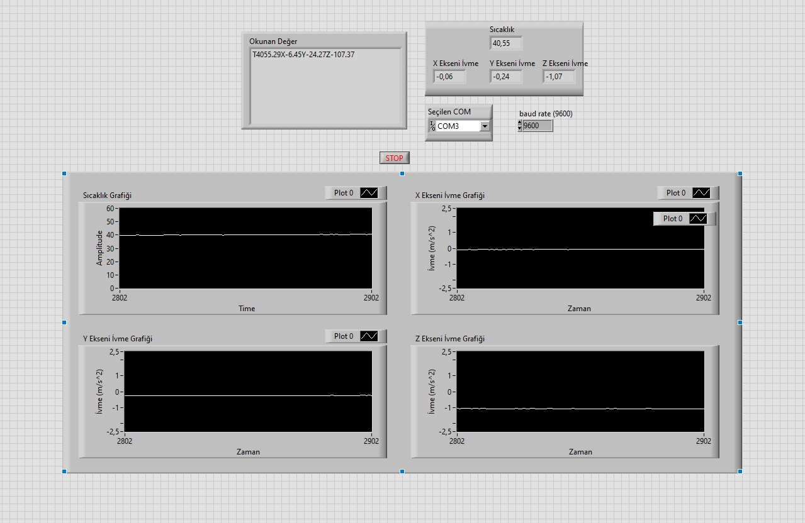
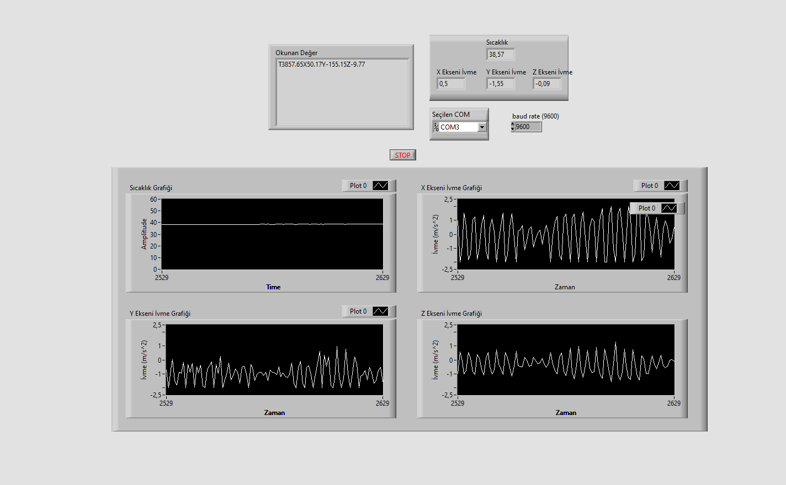

# HydroMARMARA 2021 Teknofest Roket Yarışması MPU6050 Sensörü ile Sıcaklık ve İvme Değer Ölçümü

## **Projenin Amacı** 

HydroMARMARA kulübü olarak katıldığımız "Teknofest 2021 - Roket Yarışması"nda roketin havaya fırlatıldıktan sonra havadaki ivmesini ve iticilerin sıcaklığını ölçmek için bir sensör kullanılması gerekiyordu. Roketin prototipi için MPU6050 sensörünü seçtim.

## **Nasıl Çalışıyor?** 

MPU6050 üç eksende ivme ve üzerindeki çipin sıcaklık verisini Arduino'ya verebiliyor. MPU6050 Arduino UNO ile seri haberleşme yoluyla haberleşiyor. Uno'nun serial port çıkışından LabVIEW'a değerleri okutan bir arayüz tasarladım. Back end'de Arduino'dan gelen Serial.print string bilgisini belirli bir pattern'a göre parçalanıyor. Sonrasında sensörden gelen bilgiler arayüzde float ve grafik şeklinde gösteriliyor. 

## **Kullanılan Malzemeler / Yazılımlar**

* MPU6050 İvme - Gyro sensörü
* Arduino UNO
* Arduino IDE
* LabVIEW
* Visual Studio
* Bağlantı için 4 adet Erkek - Dişi Jumper Kablo

## **LabVIEW Ekran Görüntüleri**

## **Program Çalışırken**
**Idle** 

**Çalışırken**

<>

